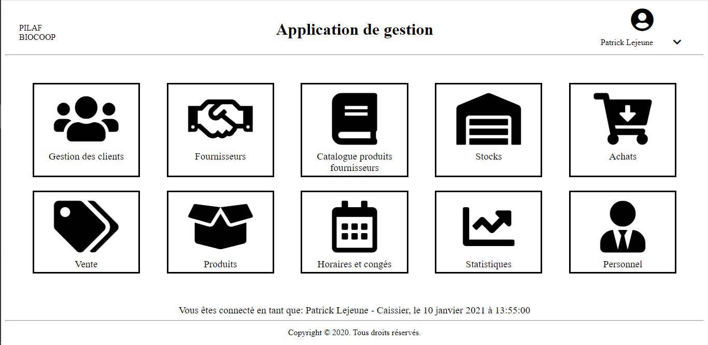

# Application de gestion  

*Dans le cadre du module M2107 (Projet tutoré - Description & Planification de projet), il s'agit "d'une application" de gestion pour une société de produits BIO s'appelant PILAF.* 

### Date de réalisation (1 mois) 
26 avril 2020 - 7 juin 2020

### Enseignants encadrants 
- Jimmy JOUANNAUD 

### Membres
- Anthony Audoin  
- Quentin Guillin  
- Marie Taconet  

### Langages
- HTML
- CSS

### Fonctionnalités
CRUD (Create Read Update Delete) dans chaque gestion :   
- Clients  
- Fournisseurs  
- Catalogue produits des fournisseurs  
- Stocks  
- Achats  
- Vente  
- Produits  
- Horaires et congés  
- Statistiques  
- Personnel  
- Connexion  

